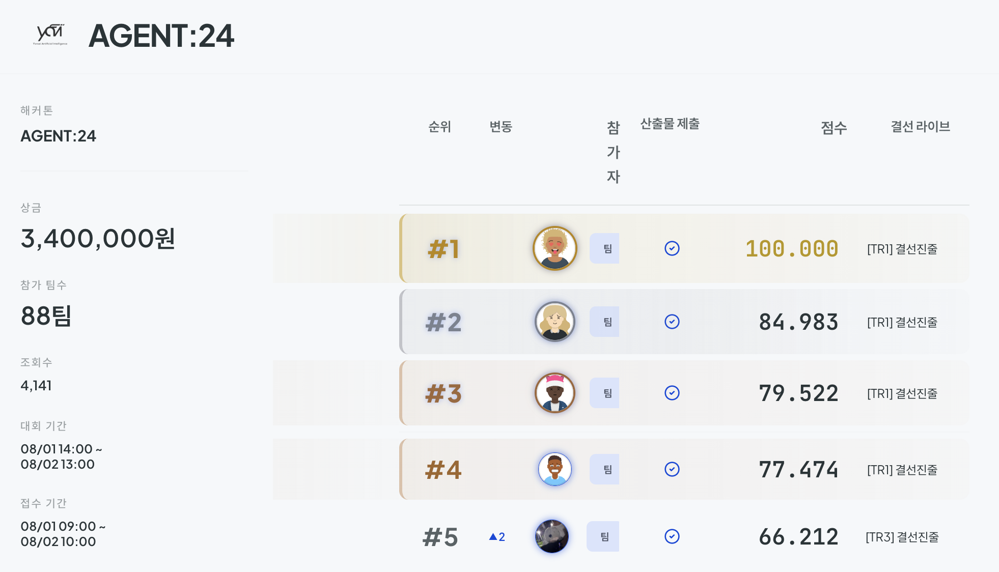
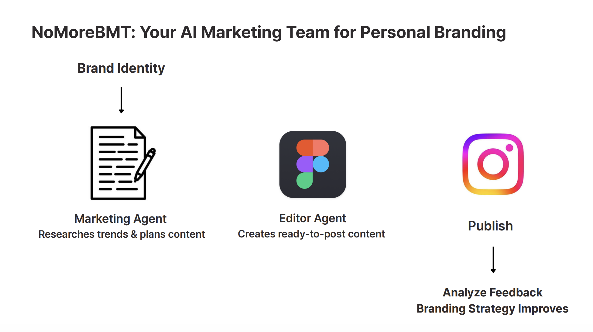

# NoMoreBMT

## YAI x OpenAI Hack #1 Leaderboard Solution

### Your AI marketing team for personal branding

NoMoreBMT turns a creator's brand identity and photo library into Instagram
content, then improves the next post from real account feedback.

`Brand identity → Research → Plan → Edit → Publish → Analyze → Improve`

This is the submission for the YAI x OpenAI [Daker Agent 24 Hackathon](https://daker.ai/public/hackathons/agent-24-hackathon).
The project ranked **#1 in the Daker mutual-evaluation leaderboard (100.000)**
and advanced to the finals.

<p align="center">
  
  
</p>
<p align="center"><sub>Daker leaderboard evidence&nbsp;&nbsp;·&nbsp;&nbsp;Pitch architecture</sub></p>

👉 **Check out our demo account!** [Instagram @nomorebamti](https://www.instagram.com/nomorebamti/)

🎥 [Watch our demo on YouTube](https://youtu.be/eud68q4d-mc) · 📄 [Read the pitch deck](./public/showcase/nomorebmt-pitch.pdf)

Team: **오픈휴먼팀** · Ryul Hwangbo · Sehyun Nam · Seonghun Jeong

## How the demo works

1. Sign in with Supabase Auth and describe the brand: mood, topics, formats,
   and Instagram handle.
2. Upload 1–9 JPG/PNG/WEBP photos and write a post brief. User assets stay in
   a private Supabase Storage bucket.
3. The **Marketing Agent** chooses a topic, researches and verifies relevant
   Instagram references, and returns two typed carousel ideas with complete
   slide plans.
4. Select an idea. The **Editor Agent** uses OpenPencil in the browser to place
   the user's photos, copy, overlays, and decorations into 1080×1350 cards.
5. The agent exports and validates every card. The user reviews the result and
   confirms publishing to Instagram.
6. `/analysis` reads the connected account's posts, comments, and insights;
   the resulting evidence-linked context guides the next content run.

## Architecture

```text
Browser: React UI + Vue/OpenPencil document + CanvasKit renderer
       ▲ SSE events / tool calls        ▼ tool responses
Next.js Node runtime: agents, tools, validation, Instagram API, Supabase
       ├─ OpenAI Agents SDK + Zod structured outputs
       ├─ Apify Instagram Scraper + verified reference ranking
       ├─ Instagram Graph API for owned-account analysis and publishing
       └─ Supabase Auth, Postgres, private Storage, and RLS
```

The browser owns the live OpenPencil document. The server owns agent reasoning
and calls browser tools through the editor SSE bridge. This lets the Editor
Agent inspect, mutate, export, and validate a real design document rather than
returning a prose-only design suggestion.

## Agent workflow

### Marketing Agent · brief to two executable plans

1. **Understand the brand** — combine the user's brief, brand identity, prior
   account feedback, and every uploaded photo.
2. **Define what to learn** — choose the post topic, objective, hook question,
   and search terms before looking for examples.
3. **Research and verify** — use Apify to scrape relevant Instagram examples,
   check topic fit and evidence quality, and refine the research loop until the
   reference set is useful.
4. **Build the strategy** — extract transferable patterns for hook, information
   order, crop, typography, and visual rhythm without copying reference images
   or inventing facts.
5. **Create two routes** — produce two genuinely different editorial directions,
   each with a caption and a complete slide plan tied to the user's photos.
6. **Hand off** — the selected route becomes the Editor Agent's authoritative
   content and image plan. The run is streamed to the ideas screen through the
   marketer bridge. Implementation: `lib/marketer-agent/` and
   `lib/reference-scout/`.

### Editor Agent · selected plan to validated carousel

1. **Receive the plan** — take the selected story, copy, image mapping, brand
   context, and references as the content contract.
2. **Inspect the document** — plan the work, inspect the current canvas, and
   identify the fixed card roots and preloaded user-image nodes.
3. **Compose card by card** — place the assigned photo, establish image/text
   hierarchy, apply crop and contrast, and keep every element inside the
   1080×1350 Instagram frame.
4. **Check the rendered result** — export each card, confirm the photo, copy,
   crop, contrast, and safe margins, then repair any visual issue.
5. **Validate and hand off** — run structural carousel validation, repair errors
   until it passes, and send the finished cards to user review and publishing.

#### Vendored OpenPencil canvas

The Editor Agent is connected to a Vue mini frontend embedded in the React app.
`EditorPlaneMount.tsx` lazy-mounts the Vue editor; `VueEditorPlane.ts` bundles
`@open-pencil/core`, `@open-pencil/vue`, and `canvaskit-wasm` into the browser,
creates the OpenPencil graph and CanvasKit canvas, and connects it to the
server agent through the SSE bridge.
We expose only the OpenPencil tools needed
for Instagram design through
`lib/editor-agent/openpencil-tools.ts`

## Instagram feedback loop · published post to next strategy

1. **Collect** recent media, comments, insights, and slide images from the
   connected Professional account.
2. **Measure** reach-normalized engagement and identify stronger/weaker posts.
3. **Interpret** the evidence into winning patterns, weak patterns, audience
   signals, visual fixes, and editor principles.
4. **Feed forward** the structured context into the next Marketing and Editor
   Agent run, then publish the next approved 2–10 image carousel.

Implementation: `lib/instagram/`, `lib/marketing-context/`, and the
`/analysis` route.

## Repository map

```text
app/page.tsx                         Main onboarding → brief → editor → review UI
app/analysis/page.tsx                Instagram feedback dashboard
app/components/VueEditorPlane.ts    Browser OpenPencil document and bridge
app/api/                             Agent, bridge, Instagram, and asset routes
lib/onboarding/                      Brand profile agent and persistence
lib/marketer-agent/                  Marketing Agent, schema, scout, SSE session
lib/editor-agent/                    Editor Agent and OpenPencil tool adapter
lib/reference-scout/                 Apify collection and reference verification
lib/marketing-context/               Owned-account analysis context
lib/instagram/                       Graph API, analytics, and publishing
lib/project-assets/                  Private Storage upload helpers
skills/                              Reusable analysis and scouting skills
supabase/migrations/                 Tables, bucket, and row-level security
public/showcase/                     Hackathon and pitch images used above
```

## Run locally

```bash
npm install
npm run dev
```

Open [http://localhost:3000](http://localhost:3000) or the feedback dashboard
at [http://localhost:3000/analysis](http://localhost:3000/analysis).

Copy `.env.example` to `.env.local`:

```bash
OPENAI_API_KEY=
OPENAI_MODEL=gpt-5.6
OPENAI_REFERENCE_MODEL=
APIFY_API_TOKEN=
INSTAGRAM_ACCESS_TOKEN=
INSTAGRAM_API_VERSION=v23.0
INSTAGRAM_APP_ID=
INSTAGRAM_APP_SECRET=
INSTAGRAM_USER_ID=
INSTAGRAM_REDIRECT_URI=http://localhost:3000/api/auth/instagram/callback
NEXT_PUBLIC_SUPABASE_URL=
NEXT_PUBLIC_SUPABASE_ANON_KEY=
```

Apply these migrations before enabling persistence:

```text
supabase/migrations/202608010001_create_user_brand_contexts.sql
supabase/migrations/202608020001_create_project_assets.sql
```

## External services setup

- **OpenAI** — Put an OpenAI API key in `OPENAI_API_KEY`; optionally set
  `OPENAI_MODEL` and `OPENAI_REFERENCE_MODEL`.
- **Apify** — Create an API token in the Apify Console and set
  `APIFY_API_TOKEN`; the scout uses `apify~instagram-scraper`.
- **Supabase** — Set the project URL and browser-safe key in
  `NEXT_PUBLIC_SUPABASE_URL` and `NEXT_PUBLIC_SUPABASE_ANON_KEY`, enable Email
  Auth, then run both migrations above to create private Storage and RLS.
- **Instagram / Meta** — Use a Professional account, create a Meta developer
  app, and put an Instagram Login token with `instagram_business_basic` and
  `instagram_business_content_publish` in `INSTAGRAM_ACCESS_TOKEN`.
- **Instagram options** — Set `INSTAGRAM_API_VERSION`; `INSTAGRAM_APP_ID`,
  `INSTAGRAM_APP_SECRET`, and `INSTAGRAM_REDIRECT_URI` are reserved for future
  per-user OAuth.

## Validation

```bash
npx tsc --noEmit
npm run build
```
